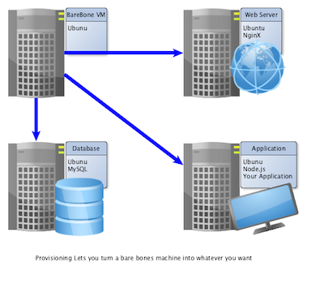
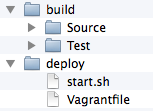

# Provisioning
Before a virtual machine image is ready to run your application, you may need to install additional software on it. For example, you may need to install a database engine, a web server, node.js and npm, or any other tools. This is, in the terminology of vagrant called **provisioning**. There are several tools available to help you with this, and vagrant provides its own simple way of doing this too (which you will try out in this module).

## Deployment
Deployment, which may be seen as a part of the provisioning is the process of taking your application, spreading it to your configuration of servers, and starting it. With Vagrant, you have two options to start with directly, if you do not go for any of the provisioning tools available. You can either use Vagrant's built-in provisioning facility to also download your application to your server and start it, or you can use the fact that the directory `/vagrant` is rsynced with your start directory. The latter means that your Vagrantfile is part of your actual build environment, which means that you only need one place to keep your files.

# Tools
Several tools exist for this process, in addition to the simplistic support provided by Vagrant itself. Below is a brief list of some of the more common tools. These are often referred to as *Configuration Management Tools*, *Orchestration Tools*, or *Provisioning Tools*.

- [Ansible](http://www.ansible.com/home)
- [Chef](https://www.chef.io/)
  - [Example tutorial by Shawn Dahlen on how to combine Vagrant and Chef](http://shawn.dahlen.me/blog/2013/04/12/manage-all-application-environments-with-vagrant/)   
- [Puppet](https://puppetlabs.com/)
  - [Example tutorial by Max Martin on using Puppet and Vagrant](http://www.linux.com/news/software/applications/694157-setup-your-dev-environment-in-nothing-flat-with-puppet) (The important stuff is on page 2).
  - [A series of Vagrant examples using Puppet with increasing complexity](https://github.com/patrickdlee/vagrant-examples)
- [Salt](http://saltstack.com/)
  - [Salt User Manual](http://docs.saltstack.com/en/latest/contents.html) Chapter 3 in particular contains tutorials.

